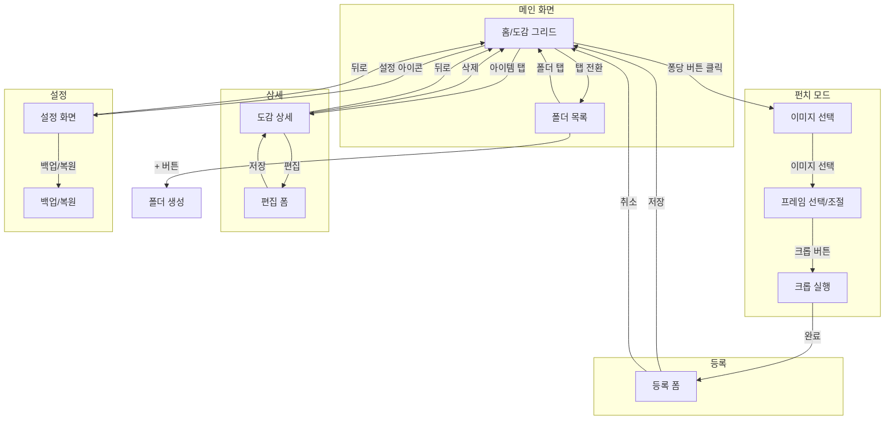

# T102: 주요 화면 와이어프레임

> 작성일: 2026-07-08
> 상태: 작성중
> 관련 태스크: T102 - 주요 화면 와이어프레임(메인, 도감, 다꾸) 구성

---

## 1. 화면 흐름도 (Screen Flow)



---

## 2. 화면별 와이어프레임

### 2.1 홈/메인 화면 (Home)

```
┌─────────────────────────────────┐
│ ← 퐁당                     ⚙️   │  ← 앱바 (설정 버튼)
├─────────────────────────────────┤
│ 🔍 검색...                      │  ← 검색바
├─────────────────────────────────┤
│ [전체] [⭐즐겨찾기] [최근]       │  ← 필터 칩
├─────────────────────────────────┤
│                                 │
│  ┌─────┐  ┌─────┐  ┌─────┐     │
│  │     │  │     │  │     │     │
│  │ 001 │  │ 002 │  │ 003 │     │  ← 도감 그리드 (2~3열)
│  └─────┘  └─────┘  └─────┘     │
│                                 │
│  ┌─────┐  ┌─────┐  ┌─────┐     │
│  │     │  │     │  │     │     │
│  │ 004 │  │ 005 │  │ 006 │     │
│  └─────┘  └─────┘  └─────┘     │
│                                 │
│            ...                  │
│                                 │
├─────────────────────────────────┤
│   [도감]        [폴더]          │  ← 하단 네비게이션
└─────────────────────────────────┘
                            (＋)   ← 퐁당 버튼 (펀치 모드 진입)
```

#### 컴포넌트 구조

```dart
Scaffold(
  appBar: AppBar(
    title: "퐁당",
    actions: [SettingsButton],
  ),
  body: Column(
    children: [
      SearchBar(),
      FilterChips(["전체", "즐겨찾기", "최근"]),
      Expanded(
        child: GridView.builder(
          gridDelegate: SliverGridDelegateWithFixedCrossAxisCount(
            crossAxisCount: 2, // 또는 3
          ),
          itemBuilder: (ctx, i) => CollectionCard(item),
        ),
      ),
    ],
  ),
  bottomNavigationBar: BottomNavBar(["도감", "폴더"]),
  floatingActionButton: PongdangButton(onPressed: goToPunchMode), // 퐁당 버튼
)
```

#### 상태 및 인터랙션

| 요소 | 액션 | 결과 |
|------|------|------|
| 검색바 | 텍스트 입력 | 실시간 필터링 |
| 필터 칩 | 탭 | 해당 조건으로 필터 |
| 그리드 아이템 | 탭 | 도감 상세 화면 이동 |
| 그리드 아이템 | 롱프레스 | 다중 선택 모드 |
| 퐁당 버튼 | 탭 | 펀치 모드 진입 |
| 하단 탭 | 탭 | 도감/폴더 뷰 전환 |

---

### 2.2 폴더 목록 화면 (Folders)

```
┌─────────────────────────────────┐
│ ← 퐁당                     ⚙️   │
├─────────────────────────────────┤
│                                 │
│  📁 카페 컬렉션          (12)   │  ← 폴더 리스트 아이템
│  ─────────────────────────────  │
│  📁 빈티지 패키지         (8)   │
│  ─────────────────────────────  │
│  📁 여행 기록            (23)   │
│  ─────────────────────────────  │
│  📁 좋아하는 것들         (5)   │
│  ─────────────────────────────  │
│                                 │
│         + 새 폴더 만들기        │  ← 폴더 생성 버튼
│                                 │
├─────────────────────────────────┤
│   [도감]        [폴더]          │
└─────────────────────────────────┘
```

#### 폴더 내부 화면

```
┌─────────────────────────────────┐
│ ←  카페 컬렉션        ✏️  🗑️   │  ← 편집/삭제 버튼
├─────────────────────────────────┤
│ 📂 서브폴더: 스타벅스 (3)       │  ← 하위 폴더 (있을 경우)
├─────────────────────────────────┤
│                                 │
│  ┌─────┐  ┌─────┐  ┌─────┐     │
│  │     │  │     │  │     │     │
│  │ 001 │  │ 002 │  │ 003 │     │  ← 폴더 내 아이템 그리드
│  └─────┘  └─────┘  └─────┘     │
│                                 │
└─────────────────────────────────┘
```

---

### 2.3 펀치 모드 - 이미지 선택

```
┌─────────────────────────────────┐
│ ✕  새로운 수집                  │  ← 닫기 버튼
├─────────────────────────────────┤
│                                 │
│                                 │
│    ┌───────────────────────┐    │
│    │                       │    │
│    │      📷 카메라        │    │
│    │                       │    │
│    └───────────────────────┘    │
│                                 │
│    ┌───────────────────────┐    │
│    │                       │    │
│    │      🖼️ 갤러리        │    │
│    │                       │    │
│    └───────────────────────┘    │
│                                 │
│                                 │
└─────────────────────────────────┘
```

---

### 2.4 펀치 모드 - 프레임 선택 & 크롭

```
┌─────────────────────────────────┐
│ ✕  크롭                  완료   │
├─────────────────────────────────┤
│                                 │
│   ┌─────────────────────────┐   │
│   │                         │   │
│   │     ╭─────────────╮     │   │  ← 이미지 위 프레임 오버레이
│   │     │             │     │   │    (드래그로 이동, 핀치로 크기조절)
│   │     │   [프레임]  │     │   │
│   │     │             │     │   │
│   │     ╰─────────────╯     │   │
│   │                         │   │
│   │      (원본 이미지)      │   │
│   │                         │   │
│   └─────────────────────────┘   │
│                                 │
├─────────────────────────────────┤
│ [엽서] [원형] [사각] [우유곽]   │  ← 프레임 선택 바 (가로 스크롤)
│  ○      ●      ○       ○       │
└─────────────────────────────────┘
```

#### 프레임 선택 바 상세

```
┌────────────────────────────────────────────────────┐
│  ┌────┐  ┌────┐  ┌────┐  ┌────┐  ┌────┐  ┌────┐  │
│  │    │  │ ○  │  │ □  │  │    │  │    │  │    │  │
│  │엽서│  │원형│  │사각│  │우유│  │폴라│  │하트│  │
│  └────┘  └────┘  └────┘  └────┘  └────┘  └────┘  │
│                    ↑ 선택됨 (하이라이트)            │
└────────────────────────────────────────────────────┘
```

#### 컴포넌트 구조

```dart
Scaffold(
  appBar: AppBar(
    leading: CloseButton(),
    title: "크롭",
    actions: [TextButton("완료", onPressed: executeCrop)],
  ),
  body: Column(
    children: [
      Expanded(
        child: InteractiveViewer(
          child: Stack(
            children: [
              Image(originalImage),
              Positioned(
                // 드래그/리사이즈 가능한 프레임
                child: GestureDetector(
                  child: FrameOverlay(selectedFrame),
                ),
              ),
            ],
          ),
        ),
      ),
      FrameSelector(
        frames: [엽서, 원형, 사각, 우유곽, 폴라로이드, 하트],
        onSelect: (frame) => setState(() => selectedFrame = frame),
      ),
    ],
  ),
)
```

---

### 2.5 등록 폼 화면 (Registration Form)

```
┌─────────────────────────────────┐
│ ←  등록하기              저장   │
├─────────────────────────────────┤
│                                 │
│      ┌─────────────────┐        │
│      │                 │        │
│      │   (크롭된 이미지 │        │  ← 미리보기
│      │     미리보기)   │        │
│      │                 │        │
│      └─────────────────┘        │
│           No. 007               │  ← 자동 부여된 번호
│                                 │
├─────────────────────────────────┤
│                                 │
│  라벨 (태그)                    │
│  ┌─────────────────────────┐    │
│  │ #카페 #빈티지  [+ 추가] │    │  ← 태그 입력 (칩 형태)
│  └─────────────────────────┘    │
│                                 │
│  별점                           │
│  ☆  ☆  ☆  ☆  ☆               │  ← 별점 선택 (1~5)
│                                 │
│  메모                           │
│  ┌─────────────────────────┐    │
│  │ 오늘 발견한 예쁜 우유곽  │    │  ← 한 줄 메모
│  └─────────────────────────┘    │
│                                 │
│  폴더 (선택)                    │
│  ┌─────────────────────────┐    │
│  │ 📁 미분류            ▼  │    │  ← 폴더 선택 드롭다운
│  └─────────────────────────┘    │
│                                 │
└─────────────────────────────────┘
```

#### 컴포넌트 구조

```dart
Scaffold(
  appBar: AppBar(
    leading: BackButton(),
    title: "등록하기",
    actions: [TextButton("저장", onPressed: saveItem)],
  ),
  body: SingleChildScrollView(
    child: Column(
      children: [
        // 이미지 미리보기
        Container(
          child: Image(croppedImage),
        ),
        Text("No. ${nextDocNumber}"),

        SizedBox(height: 16),

        // 라벨 입력
        LabelSection(
          title: "라벨 (태그)",
          child: ChipInput(
            chips: labels,
            onAdd: addLabel,
            onRemove: removeLabel,
          ),
        ),

        // 별점
        LabelSection(
          title: "별점",
          child: RatingBar(
            rating: rating,
            onChanged: (r) => setState(() => rating = r),
          ),
        ),

        // 메모
        LabelSection(
          title: "메모",
          child: TextField(
            maxLines: 2,
            maxLength: 100,
            controller: memoController,
          ),
        ),

        // 폴더 선택
        LabelSection(
          title: "폴더 (선택)",
          child: FolderDropdown(
            value: selectedFolder,
            onChanged: (f) => setState(() => selectedFolder = f),
          ),
        ),
      ],
    ),
  ),
)
```

---

### 2.6 도감 상세 화면 (Item Detail)

```
┌─────────────────────────────────┐
│ ←                    ✏️   🗑️   │  ← 편집/삭제 버튼
├─────────────────────────────────┤
│                                 │
│  ┌─────────────────────────┐    │
│  │                         │    │
│  │                         │    │
│  │      (풀스크린 이미지)   │    │  ← 탭하면 전체화면
│  │                         │    │
│  │                         │    │
│  └─────────────────────────┘    │
│                                 │
├─────────────────────────────────┤
│                                 │
│  No. 007                        │  ← 도감 번호
│  ─────────────────────────────  │
│  ⭐⭐⭐⭐☆  (4.0)              │  ← 별점
│  ─────────────────────────────  │
│  #카페  #빈티지  #디자인        │  ← 라벨 태그
│  ─────────────────────────────  │
│  "오늘 카페에서 발견한           │
│   예쁜 우유곽 디자인"           │  ← 메모
│  ─────────────────────────────  │
│  📁 카페 컬렉션                 │  ← 소속 폴더
│  📅 2026.07.08 14:32           │  ← 등록일
│                                 │
└─────────────────────────────────┘
```

#### 이미지 전체화면 모드

```
┌─────────────────────────────────┐
│                           ✕     │
│                                 │
│                                 │
│                                 │
│         (전체화면 이미지)        │  ← 핀치 줌 가능
│                                 │
│                                 │
│                                 │
│                                 │
└─────────────────────────────────┘
```

---

### 2.7 설정 화면 (Settings)

```
┌─────────────────────────────────┐
│ ←  설정                         │
├─────────────────────────────────┤
│                                 │
│  테마                           │
│  ─────────────────────────────  │
│  🎨 테마 선택              >    │  ← 테마 선택 화면으로 이동
│     현재: 복숭아 우유           │
│                                 │
│  데이터 관리                    │
│  ─────────────────────────────  │
│  📤 데이터 내보내기         >   │  ← 백업 ZIP 생성 & 공유
│  📥 데이터 가져오기         >   │  ← 백업 파일에서 복원
│  🔄 마지막 백업: 오늘 14:30     │  ← 자동 백업 상태
│                                 │
│  화면 설정                      │
│  ─────────────────────────────  │
│  🖼️ 그리드 열 개수      [2▼]   │  ← 2열/3열 선택
│  📋 기본 정렬          [최신▼]  │  ← 정렬 기본값
│                                 │
│  정보                           │
│  ─────────────────────────────  │
│  📊 내 통계                 >   │  ← 총 수집 개수 등
│  ℹ️  앱 정보                >   │  ← 버전, 라이선스
│                                 │
└─────────────────────────────────┘
```

---

### 2.8 테마 선택 화면 (Theme Selector)

```
┌─────────────────────────────────┐
│ ←  테마 선택                    │
├─────────────────────────────────┤
│                                 │
│  앱 분위기를 바꿔보세요!        │
│                                 │
│  ┌─────────────────────────┐    │
│  │  ┌─────┐                │    │
│  │  │     │  복숭아 우유   │    │
│  │  │ 🍑  │  포근하고 달콤한    │    │  ← 선택됨 (체크 표시)
│  │  └─────┘           ✓   │    │
│  └─────────────────────────┘    │
│                                 │
│  ┌─────────────────────────┐    │
│  │  ┌─────┐                │    │
│  │  │     │  민트 소다     │    │
│  │  │ 🍃  │  청량하고 시원한    │    │
│  │  └─────┘                │    │
│  └─────────────────────────┘    │
│                                 │
│  ┌─────────────────────────┐    │
│  │  ┌─────┐                │    │
│  │  │     │  포도 캔디     │    │
│  │  │ 🍇  │  몽환적이고 달콤한  │    │
│  │  └─────┘                │    │
│  └─────────────────────────┘    │
│                                 │
└─────────────────────────────────┘
```

#### 테마 카드 상세

```
┌───────────────────────────────────┐
│  ┌────────┐                       │
│  │        │                       │
│  │ 컬러   │  테마 이름            │
│  │ 미리보기│  설명 텍스트         │
│  │        │                  ✓   │  ← 선택 시 체크
│  └────────┘                       │
└───────────────────────────────────┘

미리보기 영역:
- Primary 컬러 원형
- Background 컬러 배경
- 작은 UI 미리보기 (선택사항)
```

#### 컴포넌트 구조

```dart
class ThemeSelector extends StatelessWidget {
  final List<ThemeOption> themes = [
    ThemeOption(
      id: 'peach',
      name: '복숭아 우유',
      description: '포근하고 달콤한',
      emoji: '🍑',
      primaryColor: Color(0xFFFFAB91),
      backgroundColor: Color(0xFFFFF8F0),
    ),
    ThemeOption(
      id: 'mint',
      name: '민트 소다',
      description: '청량하고 시원한',
      emoji: '🍃',
      primaryColor: Color(0xFF88D4AB),
      backgroundColor: Color(0xFFF5FBF7),
    ),
    ThemeOption(
      id: 'lavender',
      name: '포도 캔디',
      description: '몽환적이고 달콤한',
      emoji: '🍇',
      primaryColor: Color(0xFFB8A9C9),
      backgroundColor: Color(0xFFFAF8FC),
    ),
  ];

  Widget build(context) {
    return ListView.builder(
      itemCount: themes.length,
      itemBuilder: (ctx, i) => ThemeCard(
        theme: themes[i],
        isSelected: currentTheme == themes[i].id,
        onTap: () => selectTheme(themes[i].id),
      ),
    );
  }
}
```

---

### 2.9 백업/복원 화면

#### 내보내기 플로우

```
┌─────────────────────────────────┐
│ ←  데이터 내보내기              │
├─────────────────────────────────┤
│                                 │
│    ┌───────────────────────┐    │
│    │   📦                  │    │
│    │   백업 파일 생성 중...│    │
│    │   ████████░░ 80%      │    │  ← 프로그레스 바
│    └───────────────────────┘    │
│                                 │
│  포함 항목:                     │
│  ✓ 이미지 127개                │
│  ✓ 폴더 8개                    │
│  ✓ 설정                        │
│                                 │
└─────────────────────────────────┘
          ↓ 완료 후
┌─────────────────────────────────┐
│        공유 방법 선택           │
├─────────────────────────────────┤
│  📱 카카오톡                    │
│  ✉️  메일                       │
│  ☁️  Google Drive               │
│  💾 파일에 저장                 │
│  ...                            │
└─────────────────────────────────┘
```

#### 가져오기 플로우

```
┌─────────────────────────────────┐
│ ←  데이터 가져오기              │
├─────────────────────────────────┤
│                                 │
│  ⚠️ 주의사항                    │
│  가져온 데이터는 기존 데이터와  │
│  병합됩니다.                    │
│                                 │
│    ┌───────────────────────┐    │
│    │                       │    │
│    │   📁 백업 파일 선택   │    │
│    │                       │    │
│    └───────────────────────┘    │
│                                 │
│  복원 옵션:                     │
│  ○ 병합 (기존 유지 + 추가)     │
│  ○ 덮어쓰기 (기존 삭제)        │
│                                 │
│    [      가져오기 시작      ]  │
│                                 │
└─────────────────────────────────┘
```

---

## 3. 공통 컴포넌트

### 3.1 CollectionCard (도감 카드)

```
┌─────────────────┐
│                 │
│    (썸네일)     │   ← 1:1 비율 이미지
│                 │
├─────────────────┤
│ No.007    ⭐4   │   ← 번호 + 별점
└─────────────────┘
```

```dart
class CollectionCard extends StatelessWidget {
  final CollectionItem item;

  Widget build(context) {
    return Card(
      child: Column(
        children: [
          AspectRatio(
            aspectRatio: 1,
            child: Image.file(item.thumbnailPath),
          ),
          Padding(
            child: Row(
              mainAxisAlignment: MainAxisAlignment.spaceBetween,
              children: [
                Text("No.${item.docNumber.toString().padLeft(3, '0')}"),
                Row(children: [Icon(Icons.star), Text("${item.rating}")]),
              ],
            ),
          ),
        ],
      ),
    );
  }
}
```

### 3.2 FrameOverlay (프레임 오버레이)

```dart
class FrameOverlay extends StatelessWidget {
  final FrameType frameType;
  final Rect bounds;

  Widget build(context) {
    return CustomPaint(
      painter: FramePainter(frameType, bounds),
      child: Container(
        decoration: BoxDecoration(
          border: Border.all(color: Colors.white, width: 2),
        ),
      ),
    );
  }
}
```

### 3.3 RatingBar (별점 바)

```dart
class RatingBar extends StatelessWidget {
  final int rating;        // 1~5
  final Function(int) onChanged;

  Widget build(context) {
    return Row(
      children: List.generate(5, (i) {
        return IconButton(
          icon: Icon(
            i < rating ? Icons.star : Icons.star_border,
            color: Colors.amber,
          ),
          onPressed: () => onChanged(i + 1),
        );
      }),
    );
  }
}
```

### 3.4 ChipInput (태그 입력)

```dart
class ChipInput extends StatelessWidget {
  final List<String> chips;
  final Function(String) onAdd;
  final Function(String) onRemove;

  Widget build(context) {
    return Wrap(
      spacing: 8,
      children: [
        ...chips.map((c) => Chip(
          label: Text("#$c"),
          onDeleted: () => onRemove(c),
        )),
        ActionChip(
          label: Text("+ 추가"),
          onPressed: showAddDialog,
        ),
      ],
    );
  }
}
```

---

## 4. 네비게이션 구조

```dart
// main.dart
MaterialApp(
  initialRoute: '/',
  routes: {
    '/': (ctx) => HomeScreen(),
    '/punch': (ctx) => PunchModeScreen(),
    '/punch/crop': (ctx) => CropScreen(),
    '/register': (ctx) => RegisterScreen(),
    '/detail/:id': (ctx) => DetailScreen(),
    '/folder/:id': (ctx) => FolderScreen(),
    '/settings': (ctx) => SettingsScreen(),
    '/settings/export': (ctx) => ExportScreen(),
    '/settings/import': (ctx) => ImportScreen(),
  },
)
```

---

## 5. 변경 이력

| 날짜 | 버전 | 변경 내용 | 작성자 |
|------|------|----------|--------|
| 2026-07-08 | v0.1 | 초안 작성 | Claude + 개발자 |
| 2026-07-08 | v0.2 | FAB → "퐁당 버튼"으로 용어 변경 | Claude + 개발자 |
| 2026-07-08 | v0.3 | 테마 선택 화면 추가 (복숭아 우유/민트 소다/포도 캔디) | Claude + 개발자 |
